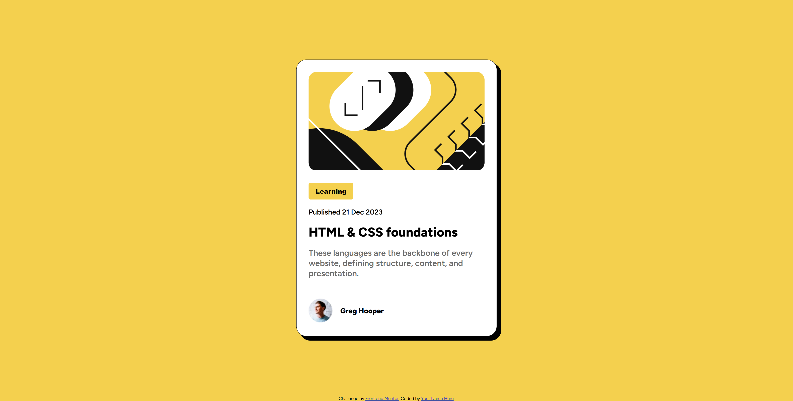

# Frontend Mentor - Blog preview card solution

This is a solution to the [Blog preview card challenge on Frontend Mentor](https://www.frontendmentor.io/challenges/blog-preview-card-ckPaj01IcS). Frontend Mentor challenges help you improve your coding skills by building realistic projects.

## Table of contents

- [Overview](#overview)
  - [The challenge](#the-challenge)
  - [Screenshot](#screenshot)
  - [Links](#links)
- [My process](#my-process)
  - [Built with](#built-with)
  - [What I learned](#what-i-learned)
- [Author](#author)

## Overview

### The challenge

See hover and focus states for all interactive elements on the page

### Screenshot



### Links

- Solution URL: [https://github.com/floradaro/blog-preview-frontendMentor]()
- Live Site URL: [https://floradaro.github.io/blog-preview-frontendMentor/]()

## My process

### Built with

- Semantic HTML5 markup
- CSS custom properties
- Flexbox
- CSS Grid
- Mobile-first workflow

### What I learned

```css
.card {
  background-color: var(--White);
  border: 1px solid var(--Gray950);
  border-radius: 25px;
  padding: 25px;
  width: 400px;
  -webkit-box-shadow: 10px 10px 0px 1px rgba(0, 0, 0, 1);
  -moz-box-shadow: 10px 10px 0px 1px rgba(0, 0, 0, 1);
  box-shadow: 10px 10px 0px 1px rgba(0, 0, 0, 1);
}
```

## Author

- Website - [GitHub](https://github.com/floradaro)
- Frontend Mentor - [@floradaro](https://www.frontendmentor.io/profile/floradaro)
- LinkedIn - [@floradaro](https://www.linkedin.com/in/floradaro/)
